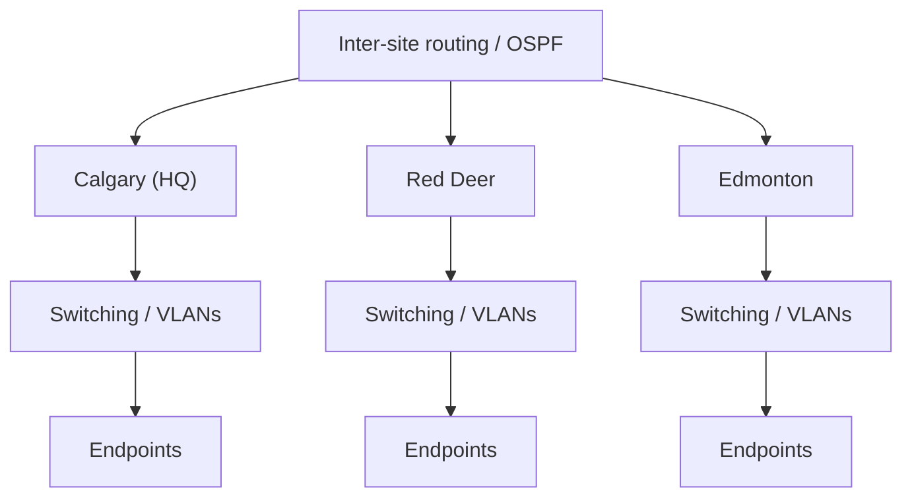

# Enterprise Multi-Site Network Infrastructure

A Cisco Packet Tracer academic project focused on multi-site network design, IPv4/IPv6 addressing, routing, switching, and shared network services.

> **Portfolio case study:** https://devanshujamwal.github.io/Devanshujamwal/projects/enterprise-network/

## Overview

The project models a company network spanning **Calgary (HQ), Red Deer, and Edmonton**. The team designed addressing and connectivity for multiple sites and documented the implementation in the included project reports.

My documented contribution focused on **Site 3 IPv4/IPv6 addressing and network documentation**, while the overall project demonstrates how routed sites, local switching, addressing, and infrastructure services fit together.

## Objective

Build a structured multi-site network that can support end-to-end communication between separate locations while keeping addressing organized and scalable.

## Architecture

## Technologies

- Cisco Packet Tracer
- IPv4 and IPv6
- VLSM / subnetting
- VLANs and switching
- OSPF routing
- DHCP
- NAT
- DNS
- TCP/IP troubleshooting

## Implementation

### IPv4 subnet design
The Site 3 addressing plan uses the assigned `10.9.0.0/18` space and documents subnet allocations for LANs of different sizes. The project reports include router interfaces, switch-management addresses, endpoint addressing, and gateways.

### IPv6 addressing
The documentation includes IPv6 global-unicast, link-local, and default-gateway assignments as part of the dual-stack design.

### Routing and services
The broader topology combines routed multi-site connectivity with switching and common infrastructure concepts such as OSPF, DHCP, NAT, and DNS.

## Troubleshooting approach

Network issues were approached from the bottom up:

1. Confirm endpoint addressing, subnet masks/prefixes, and default gateways.
2. Verify interface and VLAN state.
3. Review routing information and inter-site reachability.
4. Check shared services such as DHCP and DNS.
5. Retest connectivity after each change.

A documentation review also identified a gateway/interface inconsistency in the Site 3 report. The case study treats this as a documentation discrepancy rather than claiming an unverified live fault.

## Validation

The repository preserves the original Packet Tracer project and project documentation. The network was built for academic routing and connectivity testing; the portfolio avoids inventing command output that is not preserved in the source material.

## Documentation

- [Architecture notes](./docs/architecture.md)
- [Network troubleshooting playbook](./docs/troubleshooting-playbook.md)

## Repository contents

- `NETWORK PROJECT.pkt` — Cisco Packet Tracer project
- `NETWORK PROJECT (CPNT).pdf` — project requirements/report material
- `NETWORKS PROJECT.pdf` — supporting project documentation

## What I learned

This project strengthened my understanding of how subnet planning, routing, switching, addressing consistency, and network services depend on one another. It also reinforced how important accurate documentation is during troubleshooting.

## Portfolio

See the full recruiter-facing case study, architecture diagram, and related work:

**https://devanshujamwal.github.io/Devanshujamwal/**

---
**Devanshu Jamwal** · IT Support · Systems · Networking · Cloud
