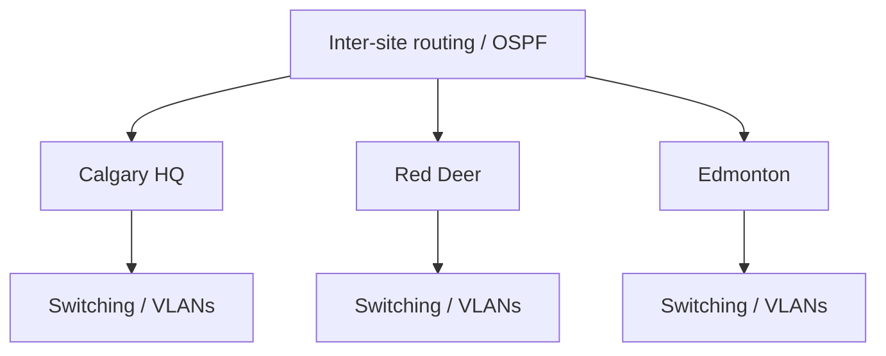

# Enterprise Multi-Site Network Infrastructure

A multi-site Cisco Packet Tracer project covering **IPv4/IPv6 addressing, VLSM, VLANs, OSPF, DHCP, NAT, DNS, and structured troubleshooting**.

**Portfolio case study:** https://devanshujamwal.github.io/projects/enterprise-network/

## At a glance

| Area | Details |
|---|---|
| Environment | Cisco Packet Tracer |
| Scope | Calgary HQ, Red Deer, Edmonton |
| My documented contribution | Site 3 IPv4/IPv6 addressing and network documentation |
| Core skills | Subnetting, routing, switching, addressing, troubleshooting |

## Architecture

## What I worked on

- Designed and documented Site 3 addressing from the assigned `10.9.0.0/18` space using VLSM.
- Documented IPv6 global-unicast, link-local, and default-gateway assignments.
- Worked within a broader routed topology using VLAN, OSPF, DHCP, NAT, and DNS concepts.
- Reviewed addressing documentation for consistency and troubleshooting impact.

## Troubleshooting approach

I work from the endpoint outward:

1. Verify IP addressing, prefix/mask, gateway, and DNS.
2. Confirm local interface and VLAN state.
3. Check routed reachability and learned routes.
4. Review infrastructure services such as DHCP, NAT, and DNS.
5. Retest after one controlled change at a time.

One Site 3 report entry contains a gateway/interface inconsistency. I document it as a **documentation discrepancy**, not as an unverified live fault.

## Skills demonstrated

**Networking:** TCP/IP, IPv4, IPv6, VLSM, VLANs, OSPF, DHCP, NAT, DNS  
**Tools:** Cisco Packet Tracer  
**Operational skills:** Documentation review, dependency tracing, structured troubleshooting

## Repository contents

- `NETWORK PROJECT.pkt` — original Packet Tracer project
- `NETWORK PROJECT (CPNT).pdf` — project material
- `NETWORKS PROJECT.pdf` — supporting documentation
- [Architecture notes](./docs/architecture.md)
- [Network troubleshooting playbook](./docs/troubleshooting-playbook.md)

## What I learned

The project reinforced that subnet planning, addressing consistency, routing, switching, and shared services are tightly connected. Clear documentation is part of troubleshooting—not separate from it.

## Next improvements

If I extend this project, I would add sanitized router/switch configuration exports and repeatable connectivity checks so the repository includes stronger as-built evidence.

---
**Devanshu Jamwal** · IT Support · Systems · Networking · Cloud  
[Portfolio](https://devanshujamwal.github.io/) · [GitHub Profile](https://github.com/Devanshujamwal)
